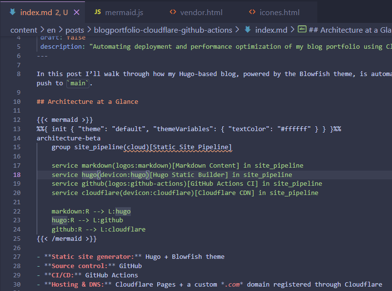

In this post I’ll walk through how my Hugo-based blog, powered by the Blowfish theme, is automatically built and deployed to Cloudflare Pages every time I push to `main`.

## Architecture at a Glance


%%{ init { "theme": "default", "themeVariables": { "textColor": "#ffffff" } } }%%
architecture-beta
    group site_pipeline(cloud)[Static Site Pipeline]

    service markdown(logos:markdown)[Markdown Content] in site_pipeline
    service hugo(devicon:hugo)[Hugo Static Builder] in site_pipeline
    service github(logos:github-actions)[GitHub Actions CI] in site_pipeline
    service cloudflare(devicon:cloudflare)[Cloudflare CDN] in site_pipeline

    markdown:R --> L:hugo
    hugo:R --> L:github
    github:R --> L:cloudflare


- **Static site generator:** Hugo + Blowfish theme
- **Source control:** GitHub
- **CI/CD:** GitHub Actions
- **Hosting & DNS:** Cloudflare Pages + a custom *.com* domain registered through Cloudflare

## GitHub Actions Workflow

So since I use static site generator with full control over the HTML, CSS, and JavaScript, even the content management service is handled by hugo with Makrdown language and a flexible shortcode by Blowfish Theme. I can use GitHub Actions to automate the build and deployment process.

## Cloudflare Pages & Domain Setup

To set up Cloudflare Pages, I created a new project and connected it to my GitHub repository. I configured the build settings to use Hugo as the build command and set the output directory to `public`, which is where Hugo generates the static files. So the clouflare pages pick the github pages and connect it to the domain I bought from Cloudflare.

## Nice Features

So since, apperently the blowfish theme is a very good theme, it has some nice features like:

- **Automatic Image Optimization**: The theme automatically optimizes images for better performance, which is great for loading speed.
- **Responsive Design**: The theme is fully responsive, ensuring that the site looks good on all devices.
- **SEO Optimization**: The theme includes built-in SEO features, making it easier for search engines to index the site.
- **Customizable Layouts**: The theme allows for easy customization of layouts and styles, making it flexible for different content types.
- **Social Media Integration**: The theme supports social media links and sharing options, enhancing user engagement.
- **Analytics Integration**: The theme can easily integrate with analytics tools to track site performance and user behavior.
