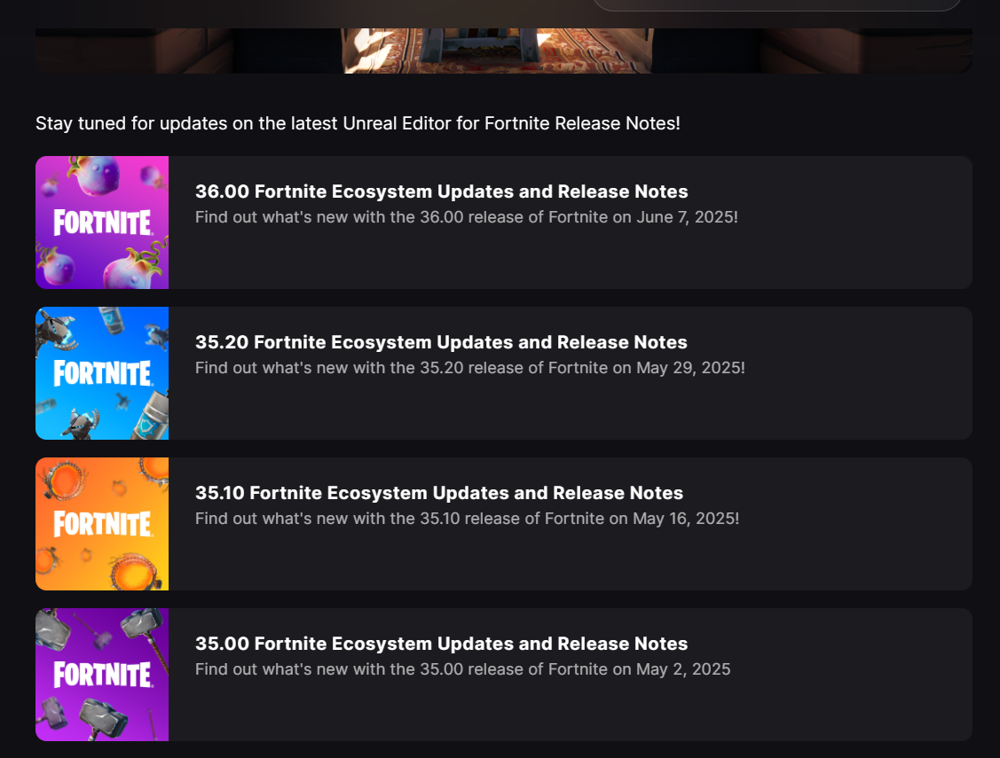

## Why Parkour Paradise in Fortnite?

Ever since **Hielke’s *Parkour Paradise*** series took off in Minecraft, I’ve loved the idea of a single map that layers dozens of bite-sized challenges into one satisfying marathon. Fortnite’s **UEFN** finally lets us script, model, and publish our own islands with almost the same freedom as a standalone Unreal project—so I’m building a *100-level* gauntlet that feels familiar to Minecraft veterans yet leverages Fortnite movement (mantle, slide, sprint) and visuals.

---

## High-Level Design

| Goal | Details |
|------|---------|
| **100 distinct checkpoints** | Each level lasts 10–40 seconds for an average player. |
| **Rising difficulty curve** | Every 10 levels introduces a new mechanic (e.g., air vents, moving platforms, slide-jumps). |
| **No dead-ends** | Miss a jump? Fall zones funnel players to the last checkpoint—no lengthy back-tracking. |
| **Speedrun friendly** | Integrated timer, gold/silver/bronze splits, and leaderboard widget. |

I’m blocking out levels in groups of 10 to iterate faster, then art-pass once the movement feels right.

---

## Tools & Workflow

1. **Grey-box** in UEFN with simple shapes and the *ParkourCheckDevice* (custom Verse script storing progress).  
2. **Playtest** locally with friends via private code; gather heat-map data on where players fall.  
3. **Art pass** in chunks: replace primitives with stylised geometry, enable Lumen for soft lighting, and sprinkle VFX.  
4. **Performance sweep** on Switch and last-gen consoles; trim materials or swap meshes as needed.  
5. **Push** to Creative Sandbox for public playtest → collect analytics → repeat.

---

## Current UEFN Pain Points (May 2025)

| Limitation | Impact on a 100-Level Parkour Map | Practical Work-around |
|------------|-----------------------------------|-----------------------|
| **Rapid, unstable feature updates** | Weekly client patches can change the editor UI or Verse APIs overnight, forcing unplanned re-builds. | Keep a frozen branch in source control; wait 48 h after each release before upgrading your main dev build. |
| **Updates sometimes break working content** | Projects that opened fine yesterday may throw Verse compile errors or fail to load checkpoints after a hot-fix. | Pin every milestone to a tagged Git commit; test new versions in a scratch copy and roll back if critical devices fail. |
| **Metaverse-first roadmap** | Epic’s priority list skews toward big, shared world features—smaller QoL requests (e.g., finer timer controls) slide down the queue. | Track the Trello roadmap and design levels around what already exists; up-vote community tickets to raise visibility. |
| **Less-diverse player base than Roblox** | Fortnite’s audience is ~60 % ages 18–24, whereas Roblox remains majority under-16; feedback may tilt toward shooter veterans, not younger casuals. | Recruit broader testers via Discord servers, TikTok, and school esports clubs; consider cross-posting demos on Roblox to reach younger players. |
| **High-end PC strongly recommended** | UEFN editing is sluggish on laptops without a discrete GPU and <16 GB RAM, slowing iteration on large obstacle courses. | Develop on a desktop with ≥16 GB RAM + mid-range GPU, or stream UEFN remotely from a cloud workstation; keep grey-box assets lightweight until final art pass. |

---

## Progress Snapshot (Update November 15, 2024)

- **Levels completed:** 30/100 playable  
- **Art-pass finished:** 1-10 are proven cool  
- **Average clear time:** 6 min 12 s (internal test)  
- **Most-failed jump:** Level 8 triple corner jump (32 % fail rate)  
- **Bugs:** Vent momentum boost sometimes stacks (investigating)

---

## Next Steps

1. Finish grey-box for levels 40–60 (introduce **ice slide** mechanic).  
2. Polish existing timer UI and integrate global leaderboard service.  
3. Record a teaser clip for TikTok/X (target 30 s vertical).  
4. Reach out to the *Parkour Paradise* creator for a friendly shout-out once we’re near beta.

---

## Get Involved

- **Playtest**: Want early access? DM me on Bsky for a private island code.  
- **Feedback**: Join the Discord and drop your checkpoint completion times.  
- **Collab**: 3D artists or Verse scripters looking for a side project are welcome, let’s polish this to a shine!

Stay tuned for the next dev-blog covering ice mechanics and the first public stress test. 🚀
